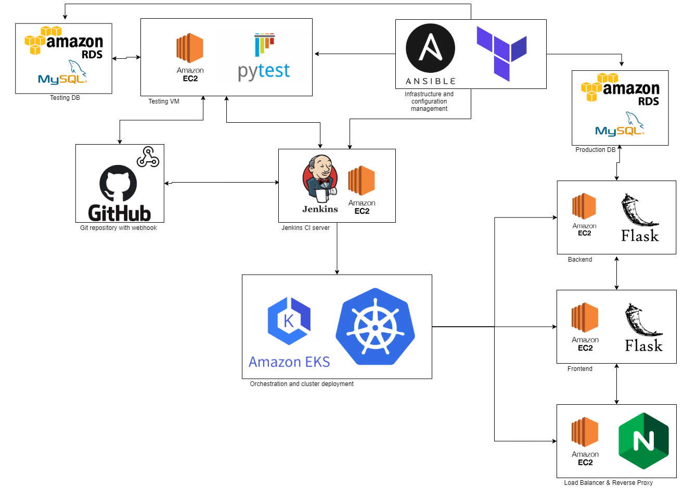
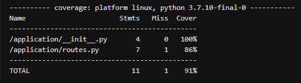
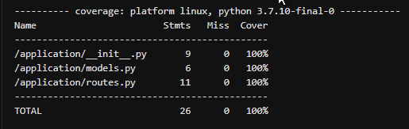

# CNE-Project-2

## Brief

The goal of this project is to efficiently deploy a flask application. The code for the application was provided by the breif and I am required to engineer a **continuous integration pipeline** that encompasses all of the technologies learned in the module since the last project.

## Requirements

* Jira board will all tasks needed to complete the project
* Application deployed using containerisation and orchestration tools
* Application must be tested through the CI pipeline
* The project must make use of two managed database servers. One for testing and one for production
* Webhooks must be used so that Jenkins automatically deploys the updated application
* The infrastructure for the project should be configured using an infrastructure management tool
* The project must use an Anisible Playbook that provisions the environment for the CI server.
* The project must make use of a reverse proxy to make your application accessible to the user.

## Constraints

These are the technologies that must be used:
* Kanban Board: Jira
* Version Control: Git
* CI Server: Jenkins
* Configuration Management: Ansible
* Cloud Server: AWS EC2
* Database Server: AWS RDS
* Containerisation: Docker
* Reverse Proxy: NGINX
* Orchestration Tool: Kubernetes
* Infrastructure Management: Terraform

## Architecture

Below is a diagram displaying the architecture of my system

 

This diagram shows how terraform provisions multiple EC2 and RDS resources. Ansible then configures the two EC2 instances using the playbook. Differnt modules will be installed on each EC2 depending on its use. 

The Jenkins CI server is responsible for keeping the application up to date by listening for the webhook from the Git repository. When a change is made to the application, the Jenkins VM will fetch the new files and perform tests on them. This is done by executing the test scripts on frontend and backend containers located on the Testing VM. The Testing VM uses the Testing DB RDS to complete its testing. It then prints the coverage to the jenkins logs so that an administrator could check the application has no major problems.

After testing the application the Jenkins VM will attempt to create an EKS cluster if there is not already one existing for the given application. After this the Jenkins VM uses Kubernetes to deploy the three pods (Frontend, Backend, NGINX) over the three nodes inside the EKS Cluster.

## Testing

The testing of this application was done using pytest and the testing scripts were provided. Here are the coverage reports from my testing:

### Frontend Tests
 

### Backend Tests
 

## Potential Improvments

I feel there are a couple of areas where my project could be improved upon and would have resolved these issues had there been no time constraint:
* The NGIX pod does not work correctly, Ive spent a whole work-day trying to debug this issue with the help of my trainers and I am still unable to fix its functionality.
* I would like to store credentials more securely and use better security practices
* I would have liked to deploy my EKS Cluster through terraform

